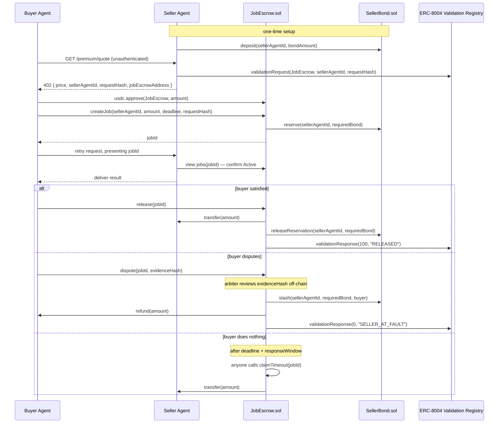

# Tripwire

Escrow-backed job settlement for agent-to-agent USDC payments on Arc — payment releases only
on verified delivery, backed by a slashable seller bond.

Built for the Encode Club ARC Hackathon, **Agentic Economy track**.

## What this is, in one paragraph

Two AI agents want to trade a service for USDC on Arc. Today, payment either settles
irreversibly the instant it's sent (x402/Circle Nanopayments), or it doesn't move at all — there's
no in-between. Tripwire adds that in-between: a buyer's payment sits in an on-chain escrow
contract instead of releasing immediately, and a seller has to post a slashable USDC bond
before they're even eligible to take the job. If delivery is good, the buyer releases the
escrow and the seller gets paid in full. If it isn't, the buyer disputes, and — once resolved
— the seller's own posted stake compensates the buyer instead of the buyer just losing the
money. Two new contracts, `SellerBond.sol` and `JobEscrow.sol`, are the whole mechanism.

## Live on Arc testnet

Everything below is deployed, verified, and in use — no mocks.

| | |
|---|---|
| **JobEscrow** | [`0xf8222D7d7c31AAE7745A20a3F97BddB03D6254D7`](https://testnet.arcscan.app/address/0xf8222D7d7c31AAE7745A20a3F97BddB03D6254D7) |
| **SellerBond** | [`0xed8D1d16150e4a7b146c8A29324537E14bD88988`](https://testnet.arcscan.app/address/0xed8D1d16150e4a7b146c8A29324537E14bD88988) |
| **Owner / arbiter** | `0xC2Ce96f61a40B54C74f30f1Da73E3b8dcf3e2A2c` |
| **Identity Registry** | `0x8004A818BFB912233c491871b3d84c89A494BD9e` (ERC-8004) |
| **Validation Registry** | `0x8004Cb1BF31DAf7788923b405b754f57acEB4272` (ERC-8004) |
| **USDC** | `0x3600000000000000000000000000000000000000` |
| Chain | Arc testnet, chain id `5042002` |

Both contracts are source-verified on Arcscan.

### The proof, in one transaction

Job 1 was disputed and resolved against the seller. The buyer received **two** payments:

```
escrow refund      +0.030000 USDC
slashed seller bond +0.006000 USDC
                   ─────────────────
buyer received      +0.036000 USDC

seller posted bond   0.050000 -> 0.044000 USDC
```

[Verify the resolution transaction](https://testnet.arcscan.app/tx/0x908063239226925e8fdd2cf61c6279c55c61e623bc701d38e8f98898c105f632)

That is the whole product: the seller paid for failing, out of their own stake.

### Three seller agents, three failure modes

The demo marketplace runs three real ERC-8004 agents, each with its own independently
slashable bond, so the different outcomes can actually be experienced rather than described.

| Seller | Agent id | Behaviour |
|---|---|---|
| Meridian Data | `851889` | Delivers correctly → clean release |
| Halcyon Compute | `870620` | Returns `200 OK` with unusable content → dispute → slash |
| Vantage Labs | `870621` | Never delivers → dispute before the deadline |

All three are owned by one wallet, which the ERC-8004 registry permits; `SellerBond` keys
balances on `agentId`, so slashing one does not touch the others.


## The gap this fills

- **x402's own spec** lists escrow-style conditional payment as explicit future work — it
  doesn't do this today.
- **Circle's Agent Stack terms of service** state plainly that Circle does not guarantee the
  performance, availability, or outcome of agent-initiated transactions with third parties.
- **ERC-8004** gives agents portable identity and reputation, but says nothing about whether a
  given payment should actually go through.

Tripwire is the missing settlement condition: money doesn't fully move until the job is
verified done, and if it isn't, the seller's own stake pays the buyer back. It extends all
three systems above rather than replacing any of them.

## How it fits the Agentic Economy track

The track asks for: agents with decision logic tied to real signals, autonomous USDC
spending/settlement, use of Agent Stack for wallets/onchain actions, and use of Nanopayments/
Paymaster/App Kits where relevant.

- **The real signal** is the buyer agent's own judgment of whether delivered work is
  acceptable — that judgment is what gates release vs. dispute. It's the product, not a
  bolt-on.
- **Settlement is autonomous** once a job exists — `release`, `dispute`, and the resulting
  payout or slash all execute without a human in the loop. Only a *disputed* outcome touches
  an arbiter, and that's disclosed as a centralized, hackathon-scoped placeholder below, not
  hidden.
- **Agent Stack** already provides the buyer/seller wallets (2-of-2 MPC custody, spend limits,
  allowlists) via the forked `arc-nanopayments` repo — Tripwire's contracts sit strictly
  downstream of a payment that wallet layer already approved. We don't rebuild spend-limit
  enforcement.
- **Nanopayments (Circle Gateway)** stays in place for the 402 discovery/pricing step.
  **Paymaster isn't available on Arc at all** — disclosed honestly below, and moot in practice
  since Arc's native gas token is already USDC. **App Kits** is an optional stretch item, not
  load-bearing for the MVP.


## Architecture



The contracts live in [`contracts/src/`](contracts/src/) — a Foundry project; see
[`contracts/README.md`](contracts/README.md) for build and test commands.

## Honest disclosures

- **Dispute resolution is single-arbiter (the deployer wallet) for this hackathon** —
  centralized-for-now, not pretend-decentralized.
- **ERC-8004's Validation Registry spec is itself still under active discussion.** Every call
  into it is wrapped so a flaky registry can never block a payment from settling.
- **Circle Paymaster isn't available on Arc.** Arc's native gas token is USDC itself, so the
  underlying "agents only hold USDC" requirement is already satisfied without it.
- **The dust-job defence prices the attack rather than eliminating it.** `minJobAmount` makes
  burning a seller's validation hash cost the attacker a real amount, recoverable only by
  convincing the arbiter or by waiting out `claimTimeout` — which pays the seller. Griefing
  funds the victim. That is a strong economic deterrent, not a cryptographic guarantee.
- **An abandoned dispute freezes the seller's bond, not just that job's escrow.** A `Disputed`
  job has no timeout rescue, and its reserved bond is never released either — so one
  walked-away dispute permanently reduces the seller's free bond across all future jobs.
- **The 402 rate limiter is in-process.** It resets on restart and does not coordinate across
  instances. Sufficient for a single-node deployment, not for production.
- **The live session lends you a funded buyer agent.** A visitor has no Arc testnet USDC, so
  the browser session signs with a server-held buyer identity. That is the only simulated part
  — the escrow, bond, slash and attestations are all real and on-chain.
- **Neither contract can rotate `owner`.** There is no `transferOwnership`; if the deployer key
  is lost, the risk parameters and the registry kill switch go with it.
- **Circle Contracts (the no-code deploy platform) isn't used** — this project deploys via
  Foundry instead, a deliberate choice for a reproducible local dev/test loop while learning
  Solidity.

## Status

**Complete and running.** Contracts deployed and verified on Arc testnet, the backend creates
real jobs through the forked agent flow, and both demo runs — clean release and disputed
slash — have been executed end to end on-chain.

- **112 tests green**: 108 Foundry unit tests plus a 4-test fork suite that runs against the
  live ERC-8004 registries.
- **Coverage** includes bond deposit, the withdrawal timelock, slash-only-by-escrow, job
  creation with the bond-ratio check, release, dispute, timeout auto-release, and regression
  tests for every issue found in the pre-submission audit.
- **A browser session** at `/live` lets anyone run a real job against the deployed contracts —
  choosing a seller, funding escrow, and deciding the outcome — without a wallet of their own.

### Security audit

A full adversarial pass over the contracts and backend before submission found and fixed:

- **A near-free denial of service.** Validation request hashes are public on the registry and
  `createJob` consumed one permanently, so anyone could burn a seller's hash with a 1-unit job
  whose bond rounded to zero — locking none of their own capital and permanently blocking the
  real buyer. Fixed with `minJobAmount` plus rejection of jobs whose collateral rounds to zero.
- **An unauthenticated gas drain.** Returning a `402` registers an on-chain validation request
  paid for in USDC by the seller, and the endpoint had no rate limiting, so a plain curl loop
  could drain that wallet. Now rate-limited per IP with a global ceiling.
- **Unlimited redelivery.** A job stays `Active` until released, so the same job id and
  signature could be replayed for unlimited copies of paid content. Now one delivery per job,
  enforced by a database primary key.
- **A requestHash reuse gap** around the registry kill switch, and **an unbound redemption
  signature** (no chain or contract in the signed message).

## Repo layout

```
README.md            — this file
LICENSE              — Apache-2.0 (inherits from the included Circle sample code)
.github/workflows/   — CI: forge build/test + lint + typecheck, on every branch
arc-nanopayments/    — Next.js app: the seller's x402 endpoints, the buyer agent,
                       and the hero + live session UI. Based on circlefin/arc-nanopayments
  app/live/          — the guided browser session
  app/api/live/      — session runner, chain reads, arbiter resolution
  components/tripwire/ — UI
  lib/               — jobEscrow, x402 middleware, validation registry, rate limiting
contracts/           — Foundry project: SellerBond.sol + JobEscrow.sol
  script/demo/       — post-bond, status, and arbiter resolve-dispute scripts
```

## Run it yourself

```bash
# contracts
cd contracts && forge test                       # 108 unit tests
forge test --match-contract ArcForkIntegration \
  --fork-url https://rpc.testnet.arc.network     # 4 tests against the live registries

# app  (needs a local Supabase: npx supabase start)
cd arc-nanopayments && npm install && npm run dev

# a real job end to end, from the terminal
npm run agent                    # clean release
npm run agent -- --dispute       # dispute, then resolve it:
cd ../contracts/script/demo && ./resolve-dispute.sh <jobId> --seller-at-fault
```

## Reference links

- Arc docs: docs.arc.io
- Arc contract addresses (check before every deploy): docs.arc.io/arc/references/contract-addresses
- Arc testnet faucet: faucet.circle.com
- Circle Agent Stack: agents.circle.com
- Circle Nanopayments reference app: github.com/circlefin/arc-nanopayments
- ERC-8004 reference contracts: github.com/erc-8004/erc-8004-contracts
- ERC-8004 spec: eips.ethereum.org/EIPS/eip-8004
- x402 spec/FAQ: x402.gitbook.io/x402
